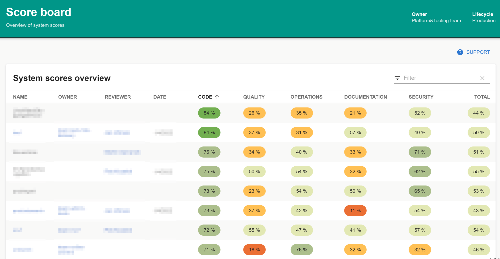
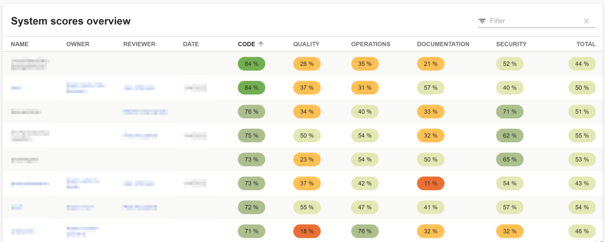
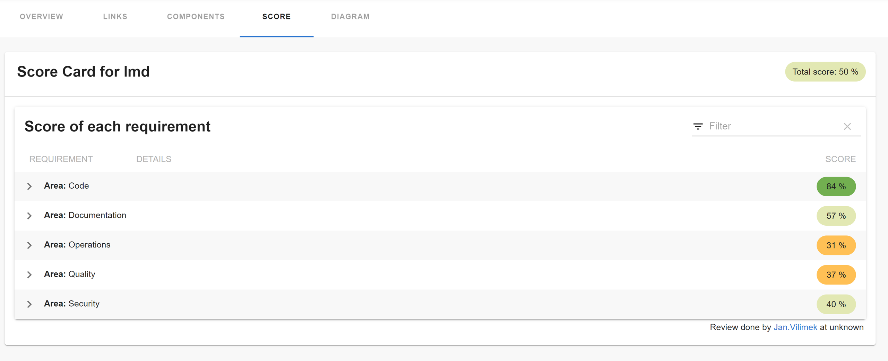
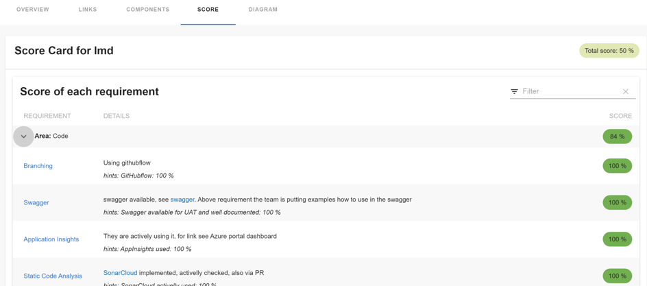

# score-card

Welcome to the score-card plugin! Main idea behind it comes from a need to somehow visualize maturity of our services and to establish a process how to improve it (discuss with the teams what to focus on next).

## Components

### ScoreBoardPage

Page that displays list of entities and their scores.



### ScoreCardTable

Table that displays list of entities and their scores.



| Props              | type                           | Description             | Default                   |
| ------------------ | ------------------------------ | ----------------------- | ------------------------- |
| `title`            | string                         | Title of the table      | Entities scores overview  |
| `entityKindFilter` | [string[]](./src/api/types.ts) | Filter entities by kind | undefined                 |

### ScoreCard

Displays detail for one entity and its scoring. You may use it in entity detail page in the catalog.



You may drill down to the details of each score together with explanation why it has such score & also a TODO for the team.



### EntityScoreCardTable

EntityScoreCardTable is component that allows you to see a table of results within an entity. This is useful for example at a system level to show the scores of all of the component within a system.

```tsx
<EntityLayout.Route path="/score" title="Score">
  <Grid container spacing={3} alignItems="stretch">
    <Grid item xs={12}>
      <EntityScoreCardTable />
    </Grid>
  </Grid>
</EntityLayout.Route>
```


| Props              | type                           | Description             | Default                   |
| ------------------ | ------------------------------ | ----------------------- | ------------------------- |
| `title`            | string                         | Title of the table      | Entities scores overview  |
| `entityKindFilter` | [string[]](./src/api/types.ts) | Filter entities by kind | undefined                 |

### ScoringDataJsonClient

There are two approaches in configuring JSON file location

#### Configuring through app-config.yaml

Implementation of `ScoringDataApi` that the above components are using to load data. This client simply reads it from a JSON files located e.g. on a blob storage account.

The location of the JSON files may be configured in `app-config.yaml' like this:

```yaml
scorecards:
  jsonDataUrl: https://raw.githubusercontent.com/Oriflame/backstage-plugins/main/plugins/score-card/sample-data/
```

In the above location it expects data in a format see [scoring data](./sample-data).

**Important**: loading from the url might be blocked by the Content-Security-Policy. In that case you would need to add the server address among `csp` settings like this:

```yaml
backend:
  csp:
    default-src: ["'self'", 'raw.githubusercontent.com']
```

Also the server providing the data needs to have correctly configured CORS policy, i.e. return HTTP header `Access-Control-Allow-Origin` that should list domain from where you serve your backstage instance. See e.g. [how to configure CORS for Azure Blob Storage](https://learn.microsoft.com/en-us/rest/api/storageservices/cross-origin-resource-sharing--cors--support-for-the-azure-storage-services).

#### Configuring through catalog-info.yaml annotations

The JSON file can also be dynamically passed through the annotations field of `catalog-info.yaml`. To achieve this, configuration of the `scorecard/jsonDataUrl` annotations is required within the `catalog-info.yaml` file, demonstrated below:

```yaml
metadata:
  annotations:
    scorecard/jsonDataUrl: 'https://github.com/oriflame/backstage-plugins/blob/master/results.json'
```

**Important note**: The `results.json` file in the example above is inside a github repository. If you use private github repos you need to configure github authentication in your backstage instance. The users authentication token will then be used to retrieve the file automatically. You can use any other http location as well, but no authentication will be brokered for those.

### Configuration

All configuration options:

- `jsonDataUrl`[optional]: url for the JSON data client, see [ScoringDataJsonClient](#scoringdatajsonclient).
- `fetchAllEntities`[optional]: if set to `true`, will fetch all the entities from the catalog and filter them afterwards. By default the entities are loaded from the catalog using a filter by name, which may result in `414 Request-URI Too Large`.
- `wikiLinkTemplate`[optional]: the template for the link to the wiki. You may use any existing properties from the `EntityScoreEntry`, e.g. `"https://TBD/XXX/_wiki/wikis/XXX.wiki/{id}"` or `"{scoreUrl}"`.

### How to use the plugin

1. Install the score-card Plugin:

   ```bash
   # From your Backstage root directory
   yarn add --cwd packages/app @oriflame/backstage-plugin-score-card
   ```

2. Add Score board to `packages/app/src/App.tsx`:

   ```diff
   +import { ScoreBoardPage } from '@oriflame/backstage-plugin-score-card';

   const routes = (
     <FlatRoutes>
   +    <Route path="/score-board" element={<ScoreBoardPage />} />
     </FlatRoutes>
   );
   ```

3. Add Link to menu `packages/app/src/components/Root/Root.tsx`:

   ```diff
   +import Score from '@material-ui/icons/Score';

   export const Root = ({ children }: PropsWithChildren<{}>) => (
      <SidebarPage>
        <Sidebar>
          <SidebarGroup label="Menu" icon={<MenuIcon />}>
            ...
            <SidebarScrollWrapper>
              ...
   +          <SidebarItem icon={Score} to="score-board" text="Score board" />
            </SidebarScrollWrapper>
          </SidebarGroup>
          ...
        </Sidebar>
        {children}
      </SidebarPage>
    );
   ```

4. Add Score Card to `packages/app/src/components/catalog/EntityPage.tsx`:

   ```diff
   +import { EntityScoreCardContent } from '@oriflame/backstage-plugin-score-card';

   const systemPage = (
      <EntityLayoutWrapper>
        <EntityLayout.Route path="/" title="Overview">
          ...
        </EntityLayout.Route>
   +
   +    <EntityLayout.Route path="/score" title="Score">
   +      <Grid container spacing={3} alignItems="stretch">
   +        <Grid item xs={12}>
   +          <EntityScoreCardContent />
   +        </Grid>
   +      </Grid>
   +    </EntityLayout.Route>
   +
      </EntityLayoutWrapper>
   );
   ```

5. If we want to have tabular Score board containing high level score of more than one component, we could add EntityScoreCardTable as shown below. Note that the difference between EntityScoreCardTable and ScoreCardTable is that EntityScoreCardTable works in the context of an Entity. That means that the Score JSON could also be read from the Component's catalog-info.yaml's Scorecard annotation as mentioned in [ Configuring through catalog-info.yaml annotations](#configuring-through-catalog-infoyaml-annotations)

Add EntityScoreCardTable to `packages/app/src/components/catalog/EntityPage.tsx` if you would like to view multiple component scores in tabular format:

```diff
+import { EntityScoreCardTable } from '@oriflame/backstage-plugin-score-card';

const systemPage = (
   <EntityLayoutWrapper>
     <EntityLayout.Route path="/" title="Overview">
       ...
     </EntityLayout.Route>
+
+    <EntityLayout.Route path="/score" title="Score">
+      <Grid container spacing={3} alignItems="stretch">
+        <Grid item xs={12}>
+          <EntityScoreCardTable />
+        </Grid>
+      </Grid>
+    </EntityLayout.Route>
+
   </EntityLayoutWrapper>
);
```

## Scoring process

To find out a `score` for your service we follow this process:

- Scoring introduction
- Team self-assessment
- Review process
- Backstage integration & visualization
- Regular update

### Scoring introduction

We have based the scoring on a set of non-functional requirements in these areas:

- **Code**: coding standards, implementation of proper logging, audits, resiliency patterns etc.
- **Quality**: coverage by unit & automated integration tests, implementation of SonarCloud, performance tests etc.
- **Operations**: readiness for operating the service such as automated ci/cd pipelines, dashboards, alerts, GitOps, DRP etc.
- **Documentation**: various documentation e.g. project description, README, wiki (business, technical), road map, etc.
- **Security**: fulfillment of our security standards.

The **main goal of the scoring** is to visualize the maturity of the services (systems). We do not expect each service to have 100 % fulfillment for every area. Primary goal is to identify where we can help the team to improve and where we should help all teams in general.

Also every service is specific and in a different state of implementation. When a team starts building a new service it is absolutely OK to have e.g. low Operations score.

So as a first step the teams need to understand why. That is why there is an important step to prepare teams for the scoring process, e.g. with following presentation: [system-scoring.pdf](docs/.assets/system-scoring.pdf).

### Team self-assessment

Team does the self assessment, that is answering a form (e.g. via Sharepoint list) with list of questions. There is a space for comments. Each requirement is described in detail in a wiki.

Example how a form in Sharepoint may look like:


### Review process

Answers & comments are reviewed together with the team by an architect. Questions are answered, possible improvements and TODOs discussed and agreed with the team & product owner(s).

### Backstage integration & visualization

There is an [integration pipeline](tools/azure-devops-pipelines/integration-with-sharepoint.yaml) that runs regularly that integrates the Sharepoint list, git repository with the [scoring data](https://github.com/Oriflame/backstage-plugins/tree/main/plugins/score-card/sample-data) and the storage account that provides JSON scoring data for the Backstage plugin to visualize results.

For more detailed info see [README](tools/azure-devops-pipelines/README.md).

### Regular update

Every 6 months (it depends) there needs to be a quick update with the team & the architect so we can see whenever we are improving.

## Local environment

You would need the same prerequisites as for backstage (node.js,...). One component you would need is `http-server` that will provide the sample data for the plugin.

Navigate to the plugin directory `/plugins/score-card` and run `yarn start:dev`. Your local DEV environment will start: <http://localhost:3024/>.

## Unit testing

To run unit tests simply execute `yarn test score-card`;

## Integration testing

This is being done as part of the backstage integration tests. See `/packages/app/e2e-tests`.

## Getting started

Your plugin has been added to the example app in this repository, meaning you'll be able to access it by running `yarn start` in the root directory, and then navigating to [/score-card](http://localhost:3000/score-card).

You can also serve the plugin in isolation by running `yarn start` in the plugin directory.
This method of serving the plugin provides quicker iteration speed and a faster startup and hot reloads.
It is only meant for local development, and the setup for it can be found inside the [/dev](./dev) directory.
